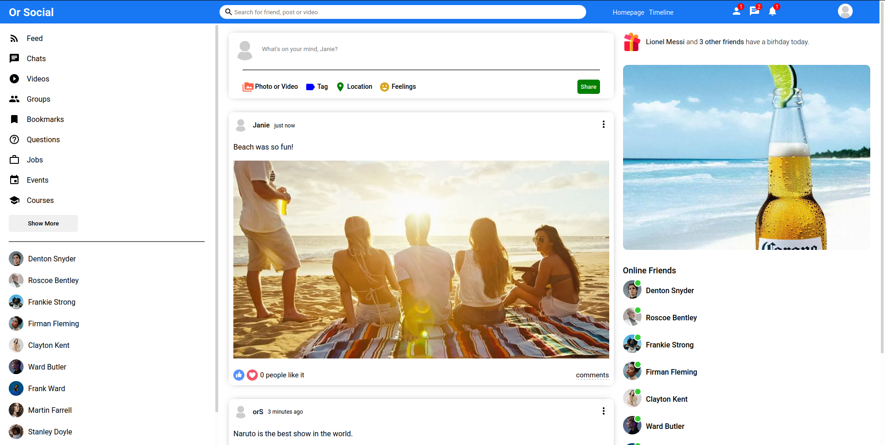

Full Stack Social Media App

Built with MERN (MongoDB, ExpressJS, React and Node.js) for practice purposes.

</img>

## Installation

Clone the repo
`git clone https://github.com/oriesh/or-social-media.git`

Make sure you have `npm` installed.

Install dependencies

    cd api
    npm install

    cd client
    npm install

Create the `.env` files:

For `api`

    MONGO_URL = `your mongo db url`

For `client`

    REACT_APP_PUBLIC_FOLDER = http://localhost:8800/images/

## Usage

Open up two terminals:

One the first one:

    cd api
    npm start

On the second one:

    cd client
    npm start

Then go to: https://localhost:3000
